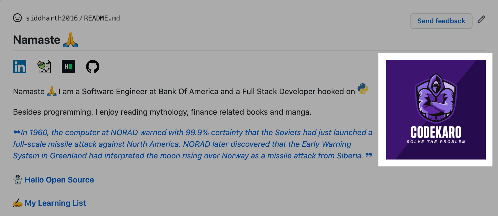

# Random Image on README  [](https://travis-ci.org/github/siddharth2016/update-readme-image)


---

## GitHub Action to update an image present on README



---

## Random Image (from a collection of given images) on your (Profile) Readme

### How To Use This Action

There is a short tutorial with enough steps for you to get started with this not-so-useful GitHub Action. Check that out [here](https://chandraji.dev/update-image-readme-see-random-image-on-your-github-profile-readme).

If you want to get an in-depth idea on the usage of this action, please follow the below points.

### Prepare Your Repository

1. You need to update the markdown file(.md) with 2 comments. You can refer [here](#update-your-readme) for updating it.
2. Make sure to have a `.github/images` folder on your profile repository or any other repository. Jump [here](#images-repository) to know more.
3. **Optional** You'll need a GitHub API Token with `repo` scope from [here](https://github.com/settings/tokens) if you're running the action for a non profile repository.
   - You can use [this](#other-repository-not-profile) example to work it out.
4. You can follow any one example below according to your needs to get started !
   - Use [this](#profile-repository) on Profile Repository.
   - Use [this](#other-repository-not-profile) on any other Repository.
5. It is better to run the Action on your Profile Repository, since you won't be needing a GitHub Access Token !
6. Check [this](#examples) to see available options while creating a workflow for this action.

---

### Update Your Readme

Add a comment to your `README.md` like this:

```md
<!--START_SECTION:update_image-->
<!--END_SECTION:update_image-->
```

You can place these 2 lines anywhere you want your images to be displayed.

---

### Images Repository

You need to have your own collection of images that you want to be displayed on your README.

You can do so in 2 ways:

1. Add `.github/images` folder on the same repository as README or on a different repository, this folder should contain the images.

You can add `.github/images` on a different repository as well, then you would need to mention that repository explicitly by passing a parameter `IMG_REPOSITORY` on your workflow yaml.

```yml
with:
  IMG_REPOSITORY: <username>/<imagerepo>
```

2. Add a folder (name it whatever you like) on the same repository as README or on a different repository, this folder should contain the images.

You need to specify `IMG_PATH` on your workflow yaml, with this if you are creating this folder on a different repository, then you would need to specify `IMG_REPOSITORY` as well.

If on same repo but image folder is not `.github/images`:
```yml
with:
  IMG_PATH: <images-folder>
```

If on a different repo and image folder is not `.github/images`:
```yml
with:
  IMG_PATH: <images-folder>
  IMG_REPOSITORY: <username>/<imagerepo>
```

---

### Profile Repository

_If you're executing the workflow on your Profile Repository  (`<username>/<username>`)_

You wouldn't need a GitHub Access Token since GitHub Actions already makes one for you.

Please follow the steps below:

1. Go to your `<username>/<username>/actions`, hit `New workflow`, then `set up a workflow yourself`, delete all the default content github made for you.
2. Copy the following code and paste it to your new workflow you created at step 1:

```yml
name: Update Image Readme

on:
  workflow_dispatch:
  schedule:
    # Runs at 1 UTC everyday
    - cron: "0 1 * * *"

jobs:
  update-readme:
    name: Update Image README
    runs-on: ubuntu-latest
    steps:
      - uses: siddharth2016/update-readme-image@main
        with:
          IMG_ALT: Image ALT
```

3. Make sure you have `.github/images` folder in `<username>/<username>` repo. If you have created a different folder, then add `IMG_PATH` after `IMG_ALT` under `with`. Check [this](#images-repository).
4. There are other options as well, height/width you want for image and it's alignment within README. Check [examples](#examples) for more.
5. Add a comment to your `README.md` like this:

```md
<!--START_SECTION:update_image-->
<!--END_SECTION:update_image-->
```

6. Go to Workflows menu (mentioned in step 1), click `Update Image Readme`, click `Run workflow`.
7. Go to your profile page, you will be able to see a random image from your collection of images.

---

### Other Repository (not Profile)

_If you're executing the workflow on another repo other than (`<username>/<username>`)_

You'll need to get a [GitHub Access Token](https://docs.github.com/en/actions/configuring-and-managing-workflows/authenticating-with-the-github_token) with a `repo` scope.

You need to save the GitHub API Token in the repository secrets. You can find that in the Settings of your Repository.

1. Go to your `<username>/<differentrepo>/actions`, hit `New workflow`, then `set up a workflow yourself`, delete all the default content github made for you.
2. Copy the following code and paste it to your new workflow you created at step 1:

```yml
name: Update Image Readme

on:
  workflow_dispatch:
  schedule:
    # Runs at 1 UTC everyday
    - cron: "0 1 * * *"

jobs:
  update-readme:
    name: Update Image README
    runs-on: ubuntu-latest
    steps:
      - uses: siddharth2016/update-readme-image@main
        with:
          IMG_ALT: Image ALT
          GH_TOKEN: ${{ secrets.GH_TOKEN }}
          README_REPOSITORY: <username>/<differentrepo> # No need to mention this if workflow present in current non profile repo.
```

Add `IMG_REPOSITORY` or `IMG_PATH` as required, check [this](#images-repository) for more info.

3. There are other options as well, height/width you want for image and it's alignment within README. Check [examples](#examples) for more.
4. Add a comment to your `README.md` like this:

```md
<!--START_SECTION:update_image-->
<!--END_SECTION:update_image-->
```

5. Go to Workflows menu (mentioned in step 1), click `Update Image Readme`, click `Run workflow`.
6. Go to your non-profile readme page, you will be able to see a random image from your collection of images.

---

### Examples

1. If you want to use this action for a README that is not present in current workflow repository.

```yml
- uses: siddharth2016/update-readme-image@main
  with:
    GH_TOKEN: ${{ secrets.GH_TOKEN }}     # Needed if README repository is not profile repo
    README_REPOSITORY: <username>/<differentrepo>
```

Using `README_REPOSITORY` will change README present in that repository head.

For example, if your workflow is present in `<username>/repo1` and you want to update README present in `<username>/repo2`, then assign `README_REPOSITORY` to `<username>/repo2` in workflow at `<username>/repo1`.

2. If your images are present in a different repository than current workflow repository.

```yml
- uses: siddharth2016/update-readme-image@main
  with:
    GH_TOKEN: ${{ secrets.GH_TOKEN }}     # Needed if README repository is not profile repo
    README_REPOSITORY: <username>/<differentrepo>  # Needed if README repository is not current repo
    IMG_PATH: <your-image-directory>        # Needed if images are not present in .github/images of image repository
    IMG_REPOSITORY: <username>/<imagerepo> 
```

It's better to have all images in `.github/images` to avoid any confusion and keep the images in same repository as of README and workflow repository.

3. If you want to set image alt, height, width and alignment, then use these flags:

```yml
- uses: siddharth2016/update-readme-image@main
  with:
    GH_TOKEN: ${{ secrets.GH_TOKEN }}     # Needed if README repository is not profile repo
    README_REPOSITORY: <username>/<differentrepo>  # Needed if README repository is not current repo
    IMG_PATH: <your-image-directory>        # Needed if images are not present in .github/images of image repository
    IMG_REPOSITORY: <username>/<imagerepo>  # Needed if images are not present in current repo
    HEIGHT: 180px       # default
    WIDTH: 180px        # default
    ALIGN: right        # default
    IMG_ALT: Profile Image      # default
```

4. You can specify a commit message to override the default _"Update Readme Image"_.

```yml
- uses: siddharth2016/update-readme-image@main
  with:
    GH_TOKEN: ${{ secrets.GH_TOKEN }}     # Needed if README repository is not profile repo
    README_REPOSITORY: <username>/<differentrepo>  # Needed if README repository is not current repo
    IMG_PATH: <your-image-directory>        # Needed if images are not present in .github/images of image repository
    IMG_REPOSITORY: <username>/<imagerepo>  # Needed if images are not present in current repo
    HEIGHT: 180px       # default
    WIDTH: 180px        # default
    ALIGN: right        # default
    IMG_ALT: Profile Image      # default
    COMMIT_MESSAGE: <your-commit-message>       # default - Update Readme Image
```

---

### Tests

To run tests simply execute the following in the directory containing `main.py`:

```bash
python -m unittest discover
```

---

#### Another intriguing action you would want to use - [quote-readme](https://github.com/marketplace/actions/quote-readme)

#### If you liked this Action and want to contribute to upgrade this utility, please create an issue or throw a PR !

---

#### Inspired From

[athul/waka-readme](https://github.com/athul/waka-readme)
